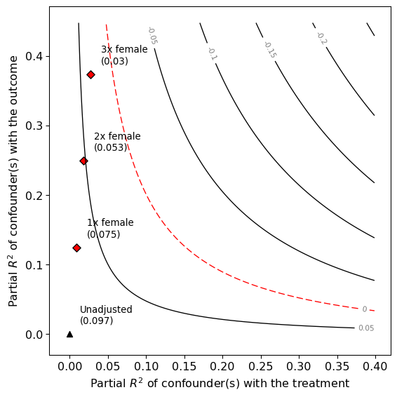
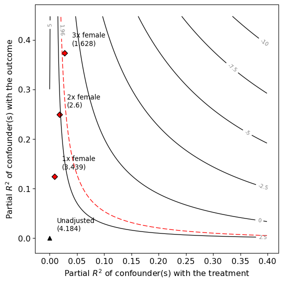
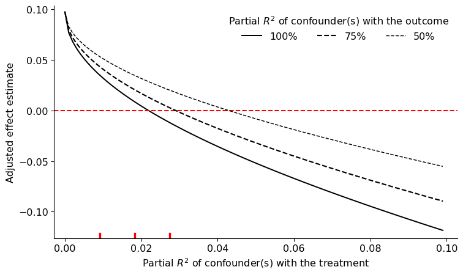

# Summary

Regression has been widely applied in statistical modeling in social science, biology etc. While regression can often help making predictions or forecasting, it is also widely used to determine causal relationships between different variables, especially in treatment-control settings. @cinelli2020making proposes a suite of sensitivity analysis tools that extends the traditional omitted variable bias framework and makes it easier to understand the causal impact of omitted variables in regression models. We want to answer questions like how strong unobserved confounders need to be to overturn our research hypothesis and how robust are the results to all unobserved confounders acting together, possibly non-linearly. ``PySensemakr`` is a Python package to address these questions based on regression output without further model assumptions. `PySensemakr` is build upon the python package ``statsmodels``, which performs regression analysis. ``Pysensemakr`` reports some key causal quantities based on the routine regression output and provides visualization and causal interpretation of these quantities. We suggest using ``Pysensemakr`` for routine reporting sensitivity analysis on regression methods to assist research on causal relationships.

This package includes unit and integration tests made using the pytest framework. The repo containing the latest project code is integrated with continuous integration using Github Actions. Code coverage is monitored via codecov and is presently above 90%. The package website contains detailed description of methods in this package as well as a quick start guide and examples for users.


# Statement of Need

While regression is widely used in Python, to the best of the author’s knowledge, there is no sensitivity analysis tool in Python that builds upon the regression output, especially for causal interest. Most causal inference packages in Python rely on additional model assumptions and constraints and are complicated in nature. ``Pysensemakr`` provides an easy way to do sensitivity analysis based on regression output and provides causal interpretation, plots, tables for researchers to use without posing further assumptions on models. The quick start guide on package website is very friendly to users who has few causal background.


# Methods

We illustrate how to use the package using a simple example:

```python
# imports sensemakr
import sensemakr as smkr
import statsmodels.formula.api as smf
```


```python
# loads darfur data
darfur = smkr.load_darfur()
```


```python
# runs regression model
reg_model = smf.ols(formula='peacefactor ~ directlyharmed + age + farmer_dar + '\
            'herder_dar + pastvoted + hhsize_darfur + female + '\
            'village', data=darfur)
darfur_model = reg_model.fit()

```


```python
# Create a sensemakr object and print summary of results
darfur_sense = smkr.Sensemakr(model = darfur_model,
                                   treatment = "directlyharmed",
                                   benchmark_covariates = ["female"],
                                   kd = [1,2,3])

# minimal reporting table
html_code = darfur_sense.ovb_minimal_reporting(format = "html")
```


\begin{table}[!h]
\centering
\begin{tabular}{lrrrrrr}
\multicolumn{7}{c}{Outcome: \textit{peacefactor}} \\
\hline \hline
Treatment: & Est. & S.E. & t-value & $R^2_{Y \sim D |{\bf X}}$ & $RV_{q =1}$& $RV_{q = 1, \alpha = 0.05}$  \\
\hline
\textit{directlyharmed} &0.097 & 0.023 & 4.184 & 2.2\% & 13.9\% & 7.6\% \\
\hline
df = 783 & & \multicolumn{5}{r}{ \small\textit{Bound (1x female)}: $R^2_{Y\sim Z| {\bf X}, D}$ = 12.5\%, $R^2_{D\sim Z| {\bf X} }$ = 0.9\%}\\
\end{tabular}
\end{table}


```python
# contour plot for the estimate
darfur_sense.plot(plot_type = 'contour',sensitivity_of = 'estimate')
# contour plot for the t-value
darfur_sense.plot(plot_type='contour',sensitivity_of='t-value')
```


{width=50% } {width=50% }


```python
# extreme scenarios plot
darfur_sense.plot(plot_type = 'extreme',sensitivity_of = 'estimate')
```


{width=70% }


@cinelli2020making extends the traditional omitted variable bias (OVB) framework for sensitivity analysis using partial R2 representation. Based on this method, the package implements partial R2 of the treatment with the outcome, robustness value, bounds on the strength of confounding using observed covariates, multiple or non-linear confounders to quantify the strength of unobserved confounders that could potentially change the research conclusion. We provide example data of Darfur [@hazlett2020angry] to illustrate the usage of these methods and provide interpretation of each quantities in the package website. @cinelli2020sensemakr contains R and Stata version of the package and we use some implementation ideas from these packages.


# Acknowledgements


# References
